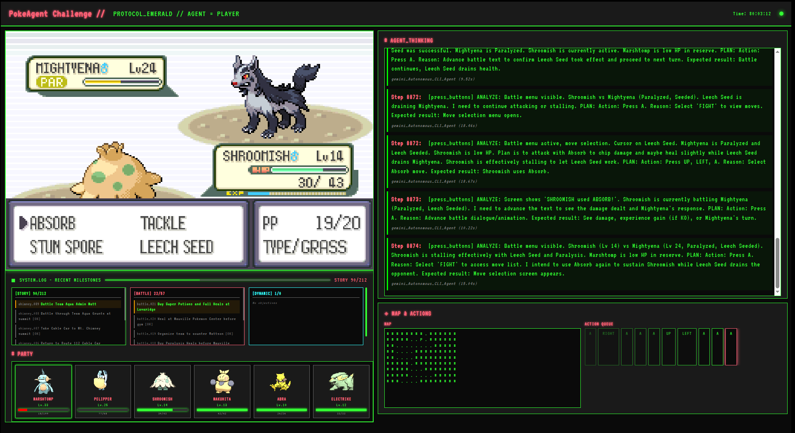
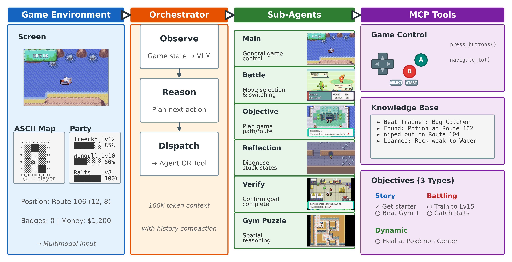

# PokéAgent Challenge: RPG Speedrunning Agent in Pokémon Emerald




An AI agent that plays Pokémon Emerald using vision-language models to perceive the game environment, plan actions, and execute gameplay strategies. This is a **starter kit** designed to be easily customizable for different VLMs and agent behaviors.

## Custom PokeAgent Harness



## Table of Contents

- [Overview](#overview)
- [Architecture](#architecture)
- [Features](#features)
- [Directory Structure](#directory-structure)
- [Requirements](#requirements)
- [Installation](#installation)
  - [1. Clone the Repository](#1-clone-the-repository)
  - [2. Create Conda Environment (Recommended)](#2-create-conda-environment-recommended)
  - [3. Install mgba System Library (Required for Python bindings)](#3-install-mgba-system-library-required-for-python-bindings)
  - [4. Install Compatible libffi in Conda (Important!)](#4-install-compatible-libffi-in-conda-important)
  - [5. Install Python Dependencies](#5-install-python-dependencies)
  - [6. Set up Game ROM](#6-set-up-game-rom)
- [VLM Backend Setup](#vlm-backend-setup)
  - [OpenAI](#-openai-gpt-4v-o3-mini-etc)
  - [OpenRouter](#-openrouter-access-to-many-models)
  - [Google Gemini](#-google-gemini)
  - [Auto Backend Detection](#-auto-backend-detection)
- [Running the Agent](#running-the-agent)
- [Command Line Options](#command-line-options)
- [Customizing Agent Behavior](#customizing-agent-behavior-prompt-editing-guide)
- [Advanced Configuration](#advanced-configuration)
- [Troubleshooting](#troubleshooting)
- [Submission Instructions](#submission-instructions)
- [Citation](#citation)
- [License](#license)

## Overview

This project implements an AI agent capable of playing Pokémon Emerald on a Game Boy Advance emulator. `PokeAgent` uses a vision-language model (VLM) to analyze game frames, understand the current game state, and make intelligent decisions to progress through the game via a series of MCP tools that we expose.


## Architecture

The system uses a **headless server**: the game and emulator run in a server process; agents and UIs run as clients. The server exposes HTTP REST and MCP endpoints; clients poll for state and submit actions.

For module-level detail, see the README in each area:
- **[server/README.md](server/README.md)** — Game server, frame streaming, MCP proxy, ports and endpoints.
- **[agents/README.md](agents/README.md)** — PokeAgent, prompts, objectives, prompt optimization.
- **[pokemon_env/README.md](pokemon_env/README.md)** — Emulator, memory reader, Porymap map data.
- **[utils/README.md](utils/README.md)** — Mapping, persistence, VLM backends, metrics.

## Features

- **Multiple VLM backends**: OpenAI, OpenRouter, Google Gemini, Anthropic, (via `utils/vlm_backends.py`)
- **Vision-based perception**: VLMs analyze game frames and state
- **Agent scaffolds**: PokeAgent (with naive prompt-optimization via self-reflection), vision-only
- **MCP support**: External CLI agents (Claude Code/Codex CLI/Gemini CLI) interact with the game state via an mcp server proxy (pokemon_mcp_server.py). Their containerization withi a Docker environment prevents them from directly interacting with the game server as most non-mcp-tool requests are dropped by firewall.
- **Checkpoints & backups**: Save/resume runs; backups in `backups/`; analysis data in `run_data/`
- **Metrics & logging**: Per-step and cumulative tokens, cost, actions, as well as run initialization settings are found in .pokeagent_cache/{run_id}/cumulative_metrics.json; LLM logs (llm_logs/) and other session logs are also tracked, though cumulative_metrics is the single source of truth.
- **Map system**: Porymap integration, NPC display, movement preview, portal tracking
- **Web interface**: Real-time stream at `http://localhost:8000/stream` by default. The port can be manually specified via the --port flag to both run.py and run_cli.py
- **Video recording**: Optional MP4 recording of gameplay saved to run_data/{run_ud}/end_state/videos/
- **Customizable prompts**: Edit prompt assets under `agents/prompts/` to directly steer agent behavior.

## Directory Structure

```
pokeagent-speedrun/
├── README.md
├── requirements.txt
├── run.py                    # Multiprocess entry: starts server + in-repo agent client
├── run_cli.py                # Entry for external CLI agents (MCP); spawns server + MCP proxy
├── server/
│   ├── app.py                # FastAPI game server (emulator, /state, /action, /mcp/*, etc.)
│   ├── agent_thinking.txt    # Runtime file (gitignored); server writes latest thinking for UI
│   ├── frame_server.py       # Frame streaming
│   ├── stream.html           # Web UI for streaming
│   └── cli/
│       └── pokemon_mcp_server.py   # MCP proxy: stdio ↔ HTTP to game server
├── agents/
│   ├── __init__.py           # Package exports (PokeAgent, VisionOnlyAgent)
│   ├── PokeAgent.py          # Main benchmark agent
│   ├── vision_only_agent.py
│   ├── puzzle_solver.py
│   ├── utils/                # prompt_optimizer, etc.
│   ├── objectives/           # Direct objectives, types, categorization
│   └── prompts/              # Canonical prompt assets and path helpers
├── utils/
│   ├── mapping/              # ascii_map_loader, map_formatter, map_stitcher, map_stitcher_singleton,
│   │                          # pathfinding, pokeemerald_parser, porymap_json_builder, porymap_state
│   ├── data_persistence/     # backup_manager, run_data_manager, llm_logger
│   ├── agent_infrastructure/ # cli_agent_backends, vlm_backends
│   ├── metric_tracking/      # session readers (claude, gemini, codex), server_metrics
│   ├── state_formatter.py    # Facade; re-exports from utils.mapping.porymap_state
│   ├── knowledge_base.py     # Shared by agents and server
│   ├── anticheat.py, coordinate_overlay.py, error_handler.py, json_utils.py, ocr_dialogue.py
│   └── ...
├── pokemon_env/
│   ├── emulator.py           # EmeraldEmulator (mGBA, input, frame advance)
│   ├── memory_reader.py      # PokemonEmeraldReader (DO NOT MODIFY for submissions)
│   ├── emerald_utils.py, enums.py, types.py, utils.py
│   ├── porymap_paths.py      # Centralized path resolution for porymap data
│   ├── porymap/              # Pokeemerald decompilation data (data/maps, data/tilesets)
│   └── ...
├── tests/
│   ├── run_tests.py, states/, ground_truth/, test_*.py
│   └── ...
├── Emerald-GBAdvance/        # rom.gba (not included), *.state
├── .pokeagent_cache/        # Runtime cache per run (checkpoints, metrics, maps)
├── backups/                 # Backup archives
├── run_data/                # Per-run analysis data
└── llm_logs/                # LLM interaction logs (auto-generated)
```

## Requirements

- Python 3.10–3.11
- Pokémon Emerald ROM (not included; obtain legally)
- One of the supported VLM backends (see VLM Backend Setup)
- mGBA system library for Python bindings

## Installation

### 1. Clone the Repository

```bash
git clone https://github.com/sethkarten/pokeagent-speedrun
cd pokeagent-speedrun
```

### 2. Environment (uv or Conda)

**Option A – uv (recommended in repo):**

```bash
curl -LsSf https://astral.sh/uv/install.sh | sh
uv sync
source .venv/bin/activate
```

**Option B – Conda:** Create and use a conda env (e.g. `pokeagent`) and install dependencies from `requirements.txt`. If you use conda, install a compatible `libffi` in the env (e.g. `conda install libffi`) so mGBA Python bindings work.

### 3. mGBA System Library

Required for Python bindings. Example (Ubuntu 20.04):

```bash
wget https://github.com/mgba-emu/mgba/releases/download/0.10.5/mGBA-0.10.5-ubuntu64-focal.tar.xz
tar -xf mGBA-0.10.5-ubuntu64-focal.tar.xz
sudo dpkg -i mGBA-0.10.5-ubuntu64-focal/libmgba.deb
```

macOS (x86_64): `brew install mgba`

### 4. Python Dependencies

With uv: `uv sync` (or `uv sync --dev` for dev deps). With pip: `pip install -r requirements.txt`.

### 5. Game ROM

Place your Pokémon Emerald ROM in `Emerald-GBAdvance/rom.gba`. US English SHA-1: `f3ae088181bf583e55daf962a92bb46f4f1d07b7`.

## VLM Backend Setup

Set the appropriate API key and run with the chosen backend.

| Backend   | Env var                | Example run |
|----------|-------------------------|-------------|
| OpenAI   | `OPENAI_API_KEY`        | `python run.py --backend openai --model-name gpt-4o` |
| OpenRouter | `OPENROUTER_API_KEY`  | `python run.py --backend openrouter --model-name anthropic/claude-3.5-sonnet` |
| Google Gemini | `GEMINI_API_KEY` or `GOOGLE_API_KEY` | `python run.py --backend gemini --model-name gemini-2.5-flash` |

Auto-detection: `--backend auto` picks a backend based on available keys.

## Running the Agent

**run.py** (in-repo agent): Starts the game server, then runs the selected agent client (with optional pygame display).

```bash
# Default (PokeAgent scaffold, Gemini)
python run.py

# OpenAI
python run.py --backend openai --model-name gpt-5.2

# Auto agent, headless, record
python run.py --agent-auto --headless --record

# Load state / checkpoint
python run.py --load-state Emerald-GBAdvance/start.state
python run.py --load-checkpoint
```

**run_cli.py** (external CLI agents via MCP): Starts the game server and MCP server; the external agent (e.g., Claude Code) connects via MCP and uses tools to play.

```bash
# Default (OAuth: claude auth login or codex login)
python run_cli.py --backend claude --directive path/to/directive.txt

# OpenRouter (no interactive login; requires OPENROUTER_API_KEY)
export OPENROUTER_API_KEY=sk-...
python run_cli.py --backend claude --api-gateway openrouter --directive path/to/directive.txt

# Gemini (always uses GEMINI_API_KEY)
python run_cli.py --backend gemini --directive path/to/directive.txt
```

| Backend | Auth (default) | Auth (--api-gateway openrouter) |
|---------|----------------|----------------------------------|
| claude  | `claude auth login` | `OPENROUTER_API_KEY` |
| codex   | `codex login`       | `OPENROUTER_API_KEY` |
| gemini  | `GEMINI_API_KEY`   | (unchanged) |

### CLI Agent (Containerized)

CLI agents run in Docker containers for security and isolation. This prevents the agent from modifying files outside the game workspace or accessing your local network.

**Prerequisites:**
1. **Docker**: Ensure Docker Desktop or Docker Engine is installed and running.
2. **Claude Code CLI**: Install the CLI tool on your host machine.
   ```bash
   npm install -g @anthropic-ai/claude-code
   ```
3. **Authentication**: Either (a) run `claude auth login` on the host (OAuth, default), or (b) set `OPENROUTER_API_KEY` and use `--api-gateway openrouter` (no interactive login).

**1. Build the Container Image**
Use the `--build` flag with `run_cli.py` to automatically build the image with your user's UID/GID. This ensures files created by the agent are owned by you (not root).

```bash
python run_cli.py --backend claude --build --directive agents/prompts/cli-agent-directives/pokemon_directive.md
```

*Manual Build (Alternative):*
If you prefer to build manually, you must pass your UID/GID:
```bash
docker build \
  -t claude-agent-devcontainer \
  --build-arg USER_UID=$(id -u) \
  --build-arg USER_GID=$(id -g) \
  -f .devcontainer/claude-agent/Dockerfile .devcontainer/claude-agent
```

**2. Run the Agent**
After building once, you can run without `--build`:
```bash
python run_cli.py --backend claude --directive agents/prompts/cli-agent-directives/pokemon_directive.md
```

**How it works:**
- **Permissions**: The container runs as a user matching your host UID, so bind-mounted files in `run_data/` and `.pokeagent_cache/` are readable/writable by both you and the agent.
- **Networking**: The agent connects to the host's MCP server via `host.docker.internal` on a bridge network.
- **Isolation**: A firewall script inside the container blocks all outbound connections except to Anthropic APIs and the MCP server.


**Debug controls (with display):** M = state overlay, Shift+M = map, S = screenshot, Tab = cycle mode, Space = one agent step, 1/2 = save/load state, arrows/WASD = move, Z/X = A/B.

**Web UI:** `http://localhost:8000/stream` (or `--port`).

## Agent Scaffolds

Choose behavior with `--scaffold` (default: `pokeagent`).

| Scaffold          | Description |
|-------------------|-------------|
| `pokeagent`       | Default. Main benchmark agent with direct objectives, knowledge, and prompt optimization. |
| `autonomous_cli`  | Legacy alias for `pokeagent`. |
| `react`           | ReAct loop: thought → action → observation. |
| `claudeplays`     | Tool-based (e.g. press_buttons, navigate_to), pathfinding, history summarization. |
| `geminiplays`     | Gemini-native tool-based agent. |
| `vision_only`     | Vision-only agent. |

Examples:

```bash
python run.py --scaffold pokeagent --agent-auto
python run.py --scaffold react --agent-auto
python run.py --scaffold claudeplays --backend openai --model-name gpt-4o --agent-auto
```

## Command Line Options

### run.py

| Flag | Description |
|------|-------------|
| `--rom PATH` | Path to the ROM file (default: `Emerald-GBAdvance/rom.gba`). |
| `--port INT` | Port for the game server and web interface (default: 8000). |
| `--load-state PATH` | Load a saved state file on startup. |
| `--load-checkpoint` | Load from checkpoint files in the run cache. |
| `--backup-state PATH` | Load from a backup zip; extracts to cache and loads checkpoint, metrics, and persistent knowledge (preferred for resuming a run). |
| `--backend NAME` | VLM backend: `openai`, `gemini`, `openrouter`, `anthropic`, or `auto` (default: `gemini`). |
| `--model-name TEXT` | Model name for the backend (default: `gemini-2.5-flash`). |
| `--scaffold NAME` | Agent scaffold: `pokeagent`, `autonomous_cli`, or `vision_only` (default: `pokeagent`). |
| `--headless` | Run without the pygame display. |
| `--agent-auto` | Run the agent in automatic mode (no manual stepping). |
| `--manual` | Start in manual mode instead of agent mode. |
| `--record` | Record video of gameplay to `run_data/{run_id}/end_state/videos/`. |
| `--no-ocr` | Disable OCR dialogue detection (default: on). |
| `--direct-objectives NAME` | Load a direct objective sequence (e.g. `categorized_full_game`, `autonomous_objective_creation`). |
| `--direct-objectives-start INT` | Start index for story objectives (default: 0). |
| `--direct-objectives-battling-start INT` | Start index for battling objectives in categorized mode (default: 0). |
| `--clear-knowledge-base` | Clear `knowledge_base.json` before starting. |
| `--run-name TEXT` | Optional suffix for the run directory name. |
| `--enable-prompt-optimization` | Enable reflective prompt optimization from trajectory analysis. |
| `--optimization-frequency INT` | Steps between prompt optimization runs (default: 10). |
| `--allow-walkthrough` | Enable `get_walkthrough` tool (vision_only scaffold). |
| `--allow-slam` | Enable SLAM / map building (vision_only scaffold). |

### run_cli.py

| Flag | Description |
|------|-------------|
| `--backend NAME` | CLI agent backend: `claude`, `gemini`, or `codex` (default: `claude`). |
| `--api-gateway NAME` | Auth: `login` (OAuth/subscription, default) or `openrouter` (uses `OPENROUTER_API_KEY`). |
| `--login` | Run backend-specific auth login before starting (e.g. `claude auth login`). |
| `--directive PATH` | Path to system prompt/directive file for the CLI agent (default: repo CLI directive). |
| `--port INT` | Port for the game server (default: 8000). |
| `--load-state PATH` | Load a saved state file on startup. |
| `--load-checkpoint` | Load from checkpoint files in the run cache. |
| `--backup-state PATH` | Load from a backup zip; extracts to cache and enables checkpoint load. |
| `--termination-condition NAME` | Condition type to stop the run (default: `gym_badge_count`). |
| `--termination-threshold INT` | Threshold for termination (e.g. 1 = first badge; default: 1). |
| `--poll-interval INT` | Seconds between termination checks (default: 10). |
| `--graceful-timeout INT` | Seconds to wait for graceful shutdown before force kill (default: 30). |
| `--dangerously-skip-permissions` | Run Claude in YOLO mode; use `--no-dangerously-skip-permissions` to disable (default: on). |
| `--record` | Record video of gameplay. |
| `--no-ocr` | Disable OCR dialogue detection (default: on). |
| `--direct-objectives NAME` | Load a specific direct objective sequence. |
| `--direct-objectives-start INT` | Start index for direct objectives (default: 0). |
| `--run-name TEXT` | Optional name for the run directory. |
| `--build` | Build the container image before running (recommended so files are owned by your user). |
| `--mcp-sse-port INT` | Port for MCP SSE server (default: game port + 2). |
| `--agent-thinking-effort LEVEL` | Thinking effort for CLI agent: `low`, `medium`, or `high`. |

## Customizing Agent Behavior (Prompt Editing Guide)

- **Prompt files**: `agents/prompts/` holds `pokeagent-directives/` and `cli-agent-directives/`; paths are repo-root-relative.
- **Main benchmark agent**: `agents/PokeAgent.py`.
- **Vision-only variant**: `agents/vision_only_agent.py`.

Edit the prompts in those files and restart the agent. Use `--debug-state` for detailed state in logs. For Nuzlocke-style behavior, change the system prompt and action/memory logic accordingly.

## Advanced Configuration

- **Environment**: `OPENAI_API_KEY`, `OPENROUTER_API_KEY`, `GEMINI_API_KEY`, `GOOGLE_API_KEY`; optional `PYTHONPATH` for development.
- **Persistence**: Checkpoints and run data are under `.pokeagent_cache/{run_id}/` and `run_data/{run_id}/`. Backups of `.pokeagent_cache/{run_id}/` are created on objective or milestone completion. See [utils/README.md](utils/README.md) for layout.
- **Metrics**: `cumulative_metrics.json` (in cache) and LLM logs; see [utils/README.md](utils/README.md).

## Troubleshooting

- **Module not found**: Ensure deps are installed (`uv sync` or `pip install -r requirements.txt`) and `PYTHONPATH` includes the repo root if needed.
- **Out of memory**: Use a smaller model or a different cloud backend (e.g. `--backend gemini --model-name gemini-2.5-flash`).
- **Web UI**: Ensure the server is running and the port (default 8000) is free; open `http://localhost:8000/stream`.
- **API rate limits**: Consider OpenRouter for alternative models.

## Fair Use and Modification Guidelines

**Allowed:** Changing agent behavior (prompts, planning, memory), adding or changing VLM backends in `utils/agent_infrastructure/vlm_backends.py`, improving logging, tests, docs, performance, UI, and utilities.

**Not allowed (for competitive submissions):** Modifying `pokemon_env/memory_reader.py` or memory-reading logic, changing how game state is extracted, altering emulator core or anti-cheat, or manipulating game memory outside normal button input.

## Submission Instructions

Ready to compete in the PokéAgent Challenge? Follow these submission guidelines to participate in Track 2.

### 🎯 Submission Overview

- **Objective**: Achieve maximum game completion in Pokémon Emerald under time constraints
- **Method**: Agents must interact exclusively through the custom Pokémon Emerald emulator API
- **Flexibility**: Use any method, as long as the final action comes from a neural network
- **Anti-cheat**: All submissions undergo verification to ensure fair competition

### 📋 Submission Requirements

Your submission must include **all three** of the following components:

#### 1. **Code Archive** 
- ZIP or TAR.GZ file containing your complete agent implementation
- Include all dependencies and a clear README with setup instructions
- Ensure your code is reproducible and well-documented

#### 2. **Action & State Logs**
- Detailed logs automatically created by this starter kit during your agent's run
- These logs are generated when you run `python run.py` and include:
  - All agent actions and decisions with timestamps
  - Game state information at each step with cryptographic hashes
  - Performance metrics and decision timing analysis
  - Anti-cheat verification data for submission validation
  - LLM interaction logs for debugging and transparency

#### 3. **Video Evidence**
- YouTube link to a screen recording showing your complete speedrun
- Must show the entire run from start to finish
- Video should clearly demonstrate your agent's performance and final game state

### 🏆 Evaluation Criteria

Your submission will be evaluated on:

1. **Milestone Completion**: Percentage of game milestones accomplished (primary metric)
2. **Completion Time**: Time taken to complete achieved milestones (secondary metric)  
3. **Reproducibility**: Clear documentation and reproducible results

### 📝 How to Submit

Submit your complete package through the official Google Form:

**🔗 [Submit Here: https://forms.gle/nFciH9DrT4RKC1vt9](https://forms.gle/nFciH9DrT4RKC1vt9)**

### 💡 Tips for Success

- **Test thoroughly**: Ensure your agent runs reliably for extended periods
- **Document everything**: Clear setup instructions help with reproducibility
- **Optimize for milestones**: Focus on completing key game objectives rather than perfect play
- **Monitor logs**: Use the generated logs to debug and improve your agent's performance
- **Record quality video**: Clear, uninterrupted footage helps with verification

The submission process emphasizes both performance (how much of the game you complete and how quickly) and transparency (providing logs and video evidence for verification).

## Citation

If you use this codebase in your research, please cite:

```bibtex
@inproceedings{karten2025pokeagent,
  title        = {The PokeAgent Challenge: Competitive and Long-Context Learning at Scale},
  author       = {Karten, Seth and Grigsby, Jake and Milani, Stephanie and Vodrahalli, Kiran
                  and Zhang, Amy and Fang, Fei and Zhu, Yuke and Jin, Chi},
  booktitle    = {NeurIPS Competition Track},
  year         = {2025},
  month        = apr,
}
```

## License

This project is licensed under the MIT License - see the [LICENSE](LICENSE) file for details. Make sure to comply with the terms of service of any VLM APIs you use.
