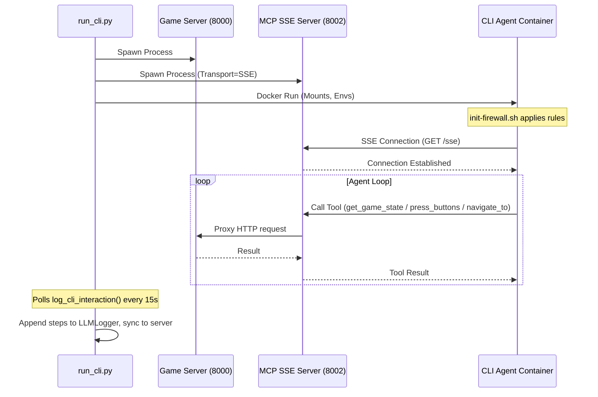

# External MCP Agents Architecture (Containerized)

This document describes the architecture for running external CLI agents (**Claude Code** and **Gemini CLI**) in secure, containerized environments to play Pokemon Emerald via MCP (Model Context Protocol).

## Overview

Unlike the internal Python agents (e.g. `PokeAgent`, `VisionOnlyAgent`) which run in the same process tree as the game client, **External MCP Agents** run as completely separate processes—typically inside a Docker container for isolation—and communicate with the game via a standardized MCP server.

This architecture allows us to use powerful, proprietary agentic tools (Anthropic's Claude Code, Google's Gemini CLI) which require their own runtime environment, while keeping the game infrastructure secure and stable.

The backend system is polymorphic: `run_cli.py` operates through the `CliAgentBackend` abstract base class (`utils/agent_infrastructure/cli_agent_backends.py`), with concrete implementations `ClaudeCodeBackend`, `GeminiCliBackend`, and `CodexCliBackend`. Backend selection is via `--backend {claude,gemini,codex}`.

## 1. System Components

The architecture consists of two main environments: the **Host** (where the game runs) and the **Container** (where the agent runs).

### Host Environment
Runs the game infrastructure and orchestration.

1.  **Orchestrator (`run_cli.py`)**:
    *   Entry point for the experiment.
    *   Spawns the Game Server, Frame Server, and MCP SSE Server.
    *   Launches the Docker container for the selected agent backend.
    *   Monitors the game state for termination conditions (e.g. badge count).
    *   Uses polymorphic calls: `backend.build_launch_cmd()`, `backend.log_cli_interaction()`, `backend.get_resume_session_id()`, `backend.run_login()`.

2.  **Game Server (`server/app.py`)**: Runs the mGBA emulator with HTTP endpoints.

3.  **MCP SSE Server (`server/cli/pokemon_mcp_server.py`)**: Exposes 3 core tools (`get_game_state`, `press_buttons`, `navigate_to`) via SSE transport, reachable from containers via `host.docker.internal`.

### Container Environments

Each backend has its own devcontainer under `.devcontainer/`:

#### Claude Agent (`claude-agent-devcontainer`)
*   **Image**: `node:20-bookworm-slim` + `@anthropic-ai/claude-code`
*   **User**: `claude-agent` (UID/GID matched to host)
*   **Auth**: `--api-gateway login` → OAuth from host `~/.claude`; `--api-gateway openrouter` → `OPENROUTER_API_KEY`
*   **MCP Config**: `.mcp_config.json` in workspace with `"type": "sse"`
*   **Firewall**: DNS + HTTPS (443) + MCP port; blocks game server port

#### Gemini Agent (`gemini-agent-devcontainer`)
*   **Image**: `node:20-bookworm-slim` + `@google/gemini-cli`
*   **User**: `gemini-agent` (UID/GID matched to host)
*   **Auth**: `GEMINI_API_KEY` passed as env var (no login flow; unaffected by `--api-gateway`)
*   **MCP Config**: `settings.json` in mounted `~/.gemini` with SSE server URL + `"trust": true`
*   **Telemetry**: Enabled in `settings.json` with `outfile` pointing to `~/.gemini/telemetry.jsonl`
*   **Firewall**: DNS + HTTPS (443, all Google domains) + MCP port; blocks game server port

#### Codex Agent (`codex-agent-devcontainer`)
*   **Image**: Node-based + `@openai/codex`
*   **User**: UID/GID matched to host
*   **Auth**: `--api-gateway login` → `codex login` (ChatGPT OAuth); `--api-gateway openrouter` → `OPENROUTER_API_KEY`
*   **MCP Config**: `config.toml` in `CODEX_HOME` with model provider and MCP server URL

## 2. Authentication & API Gateway

The `--api-gateway` flag controls how Claude Code and Codex authenticate. Gemini uses `GEMINI_API_KEY` only and is unaffected.

| Option | Description | Required Env |
|--------|-------------|--------------|
| `login` (default) | OAuth/subscription: `claude auth login`, `codex login` | Host credentials in `~/.claude` or `~/.codex` |
| `openrouter` | Use OpenRouter as API gateway; no interactive login | `OPENROUTER_API_KEY` |

**Per-backend behavior:**
- **Claude Code**: `login` → seeded OAuth from host; `openrouter` → `ANTHROPIC_BASE_URL` + `ANTHROPIC_AUTH_TOKEN` (OpenRouter key).
- **Codex**: `login` → `codex login` (ChatGPT); `openrouter` → `model_provider = "openrouter"` in config, `OPENROUTER_API_KEY` in env.
- **Gemini**: Always uses `GEMINI_API_KEY`; `--api-gateway` has no effect.

**Running experiments:**
```bash
# OAuth (default): requires prior claude auth login or codex login
python run_cli.py --backend claude --directive agents/prompts/cli-agent-directives/pokemon_directive.md

# OpenRouter: set key, no login
export OPENROUTER_API_KEY=sk-...
python run_cli.py --backend claude --api-gateway openrouter --directive agents/prompts/cli-agent-directives/pokemon_directive.md
```

## 3. Data Flow & Communication



## 4. Persistence & State

Directories are bind-mounted from the Host for persistence:

| Backend | Container Path | Host Path | Contents |
|---------|---------------|-----------|----------|
| Claude  | `~/.claude` | `.pokeagent_cache/{run_id}/claude_memory` | Project history, JSONL logs, credentials |
| Gemini  | `~/.gemini` | `.pokeagent_cache/{run_id}/gemini_memory` | Session history (tmp/workspace/chats/), settings.json |
| Both    | `/workspace` | `run_data/{run_id}/agent_scratch_space` | Agent working files, directives |

### Session Persistence for Backup Restore

*   **Location**: `.pokeagent_cache/{run_id}/last_cli_session_id` — written after each session.
*   **Backend fallback** (`get_resume_session_id()`): Claude looks in `projects/-workspace/*.jsonl`; Gemini looks in `tmp/*/chats/*.json`.
*   **Flow**: On restore, backup extracts to cache, session ID is loaded, and `--resume <session_id>` is passed.

## 5. Usage Monitoring

Metric tracking is backend-specific, accessed via the abstract `log_cli_interaction()` method:

| Backend | Source | Reader | Granularity |
|---------|--------|--------|-------------|
| Claude  | JSONL files in `claude_memory/projects/-workspace/` | `utils/metric_tracking/claude_jsonl_reader.py` | Per API call (dedup by message ID) |
| Gemini  | Session JSON in `gemini_memory/tmp/workspace/chats/session-*.json` | `utils/metric_tracking/gemini_session_reader.py` | Per message (dedup by message ID) |

*   **Single-writer**: The server is the only writer of `cumulative_metrics.json`. `run_cli` accumulates in memory and syncs via `POST /sync_llm_metrics`.
*   **Polling cadence**: Every 15 seconds (heartbeat) and once after each session exits.
*   **Gemini implicit caching**: Gemini CLI uses implicit caching (automatic; no explicit cache creation API). Step entries have `cache_write_tokens: null`—this is expected. Cost of cache creation is included in the first request's input tokens.

## 6. Security Measures

1.  **Network Isolation**: Agents cannot access the local network except via MCP. Firewall allows only DNS, HTTPS, and the MCP port.
2.  **Filesystem Isolation**: Agents are confined to mounted volumes.
3.  **Credential Safety**: Claude uses seeded OAuth; Gemini uses API key env var.
4.  **Permission Safety**: Container users have matching UID/GID to the host user.

## 7. Known Warnings (Gemini CLI)

When running the Gemini agent in containerized mode, the following messages may appear in logs. They are expected and do not indicate a failure:

| Message | Explanation | Action |
|--------|-------------|--------|
| `Timeout of 30000 exceeds the interval of 10000. Clamping...` | Gemini CLI internal MCP/SSE client adjusts a timeout to the polling interval. | None; harmless. |
| `The 'metricReader' option is deprecated. Please use 'metricReaders' instead.` | Gemini CLI uses a deprecated OpenTelemetry config key. | None until we control the CLI config; or upgrade `@google/gemini-cli` when a fix is released. |
| `YOLO mode is enabled. All tool calls will be automatically approved.` | Printed by the CLI when `--yolo` is used; may appear twice (startup). | None. |
| `MCP server 'pokemon-emerald': HTTP connection failed, attempting SSE fallback...` / `Successfully connected using SSE transport.` | In the container, the agent is configured to use SSE for MCP; the client tries HTTP first, then falls back to SSE. | None; SSE is the intended transport for containerized runs. |
