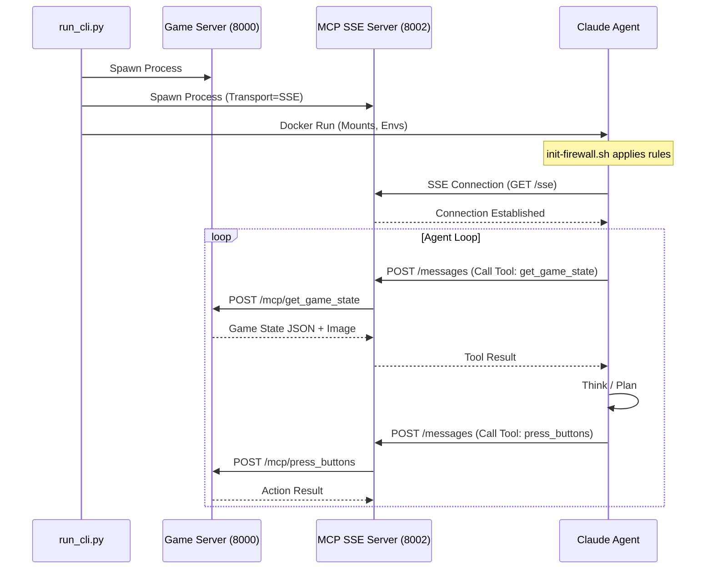

# External MCP Agents Architecture (Containerized)

This document describes the architecture for running external CLI agents (specifically **Claude Code**) in a secure, containerized environment to play Pokemon Emerald via MCP (Model Context Protocol).

## Overview

Unlike the internal Python agents (e.g. `MyCLIAgent`, `AutonomousCLIAgent`) which run in the same process tree as the game client, **External MCP Agents** run as completely separate processes—typically inside a Docker container for isolation—and communicate with the game via a standardized MCP server.

This architecture allows us to use powerful, proprietary agentic tools like Anthropic's `claude` CLI (Claude Code) which require their own runtime environment, while keeping the game infrastructure secure and stable.

## 1. System Components

The architecture consists of two main environments: the **Host** (where the game runs) and the **Container** (where the agent runs).

### Host Environment
Runs the game infrastructure and orchestration.

1.  **Orchestrator (`run_cli.py`)**:
    *   Entry point for the experiment.
    *   Spawns the Game Server (`server/app.py`).
    *   Spawns the Frame Server (`server/frame_server.py`) for visualization.
    *   Spawns the **MCP SSE Server** (`server/cli/pokemon_mcp_server.py`) as a subprocess.
    *   Launches the Docker container for the agent.
    *   Monitors the game state for termination conditions (e.g. badge count).

2.  **Game Server (`server/app.py`)**:
    *   Runs the mGBA emulator.
    *   Exposes HTTP endpoints for game state and actions.
    *   Tracks milestones and metrics.

3.  **MCP SSE Server (`server/cli/pokemon_mcp_server.py`)**:
    *   Runs a `FastMCP` server using **SSE (Server-Sent Events)** transport.
    *   Exposes 3 core tools to the agent: `get_game_state`, `press_buttons`, `navigate_to`.
    *   Acts as a proxy: receives tool calls from the agent (over HTTP/SSE), translates them into HTTP requests to the Game Server, and returns the results.
    *   **Crucial for Docker**: Binds to `0.0.0.0` so the container can reach it via the host gateway.

### Container Environment (`claude-agent-devcontainer`)
A secure, sandboxed environment for the third-party agent.

1.  **Claude Code CLI**:
    *   The actual agent process (e.g. `claude` command).
    *   Configured via `.mcp_config.json` to connect to the Host's MCP SSE server.
    *   Reads instructions from `.agent_directive.txt`.
    *   Writes persistence data (memory, history) to mounted volumes.

2.  **Firewall (`init-firewall.sh`)**:
    *   Enforces strict network isolation.
    *   **ALLOW**: DNS (53), HTTPS (443) to Anthropic APIs.
    *   **ALLOW**: TCP connection to the Host's MCP SSE port (via gateway IP).
    *   **DROP**: Direct access to the Game Server port (8000/8118) to enforce tool usage.
    *   **DROP**: All other internet access.

## 2. Data Flow & Communication

## 3. Persistence & State

To allow the ephemeral container to maintain long-term memory across sessions (or restarts), specific directories are bind-mounted from the Host. **Both live inside `.pokeagent_cache/{run_id}/`** so a single `create_cache_backup` captures everything for restore:

*   **Agent Memory**: `~/.claude` inside the container is mounted to `.pokeagent_cache/<run_id>/claude_memory` on the host. This persists the agent's project history, "brain" (memory.md), and authentication credentials.
*   **Workspace**: `/workspace` inside the container is mounted to `.pokeagent_cache/<run_id>/workspace` on the host. The orchestrator writes `.agent_directive.txt` and `.mcp_config.json` here on every launch (fresh or from backup). The agent can write files, todos, or plans here. **`.mcp_config.json` is overwritten and set read-only on every launch**—we never rely on the backup's copy.

**CLI agents do not use objectives or `knowledge_base.json`**; they use milestones only. The server skips `copy_knowledge_base` and objectives when `POKEAGENT_CLI_MODE` is set.

## 4. Security Measures

1.  **Network Isolation**: The agent cannot access the local network or the internet (except Anthropic API). It cannot "cheat" by calling the game server API directly; it *must* use the MCP tools.
2.  **Filesystem Isolation**: The agent is confined to the container. It can only modify files in the specific mounted scratch space.
3.  **Credential Safety**: OAuth credentials for Claude are seeded from the host into the mounted memory volume, preventing the need to re-login inside the container, but are isolated to that specific run directory.
